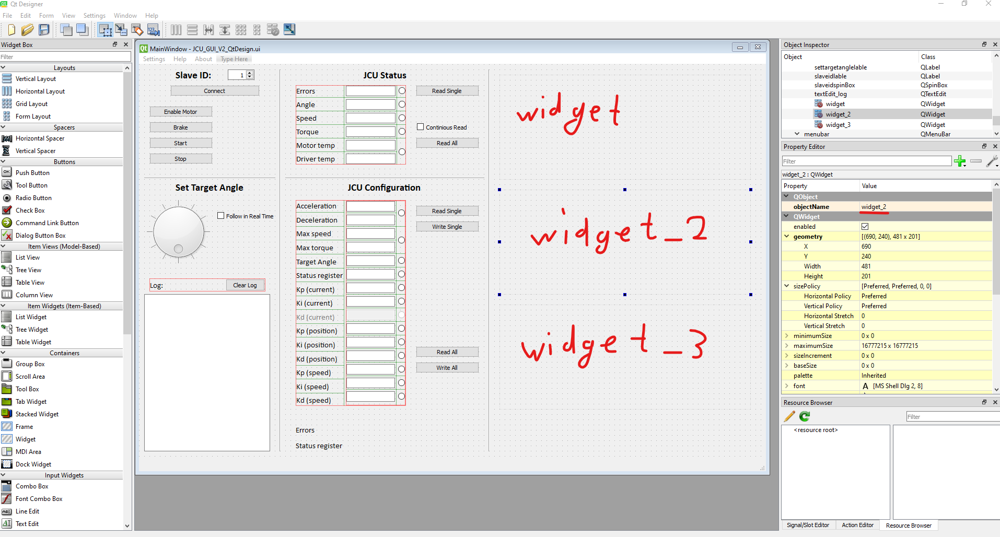
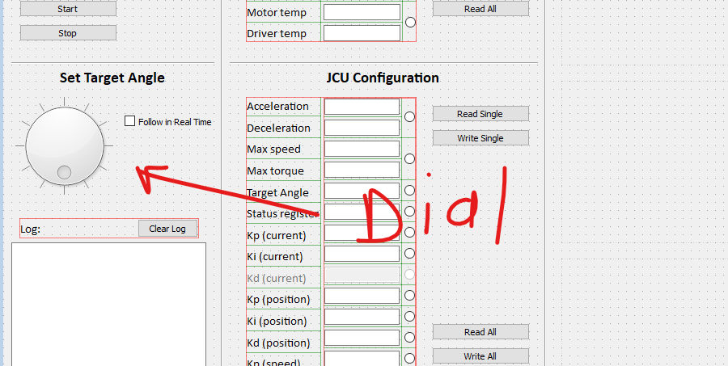
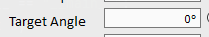
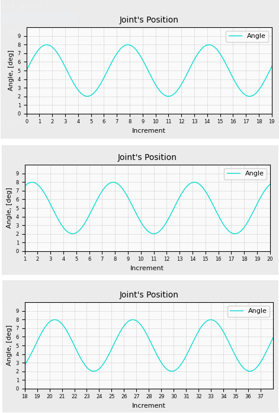

Это часть домашнего хобби проекта – робот манипулятор с 6 степенями подвижностями.

JCU GUI – Joint Control Unit, Graphical User Interface

# 1. Общие сведения

Это не большая программа для отладки звена работа манипулятора. Программа выводит на экран основные характеристики вращения звена робота (текущий угол, скорость вращение, момент на звене робота), также можно записать некоторые данные в контроллер этого звена (например коэффициенты ПИД регулятора). Связь с контроллером звена робота осуществляется с помощью RS-485 (физический уровень) и ModBus (протокольный уровень).

Программа реализована с помощью QtDesigner:




Для вывода информации в реальном времени будут использоваться графики, место для них подготовленно виджетами: `widget`, `widget_2`, `widget_3`.

Графики представляют из себя массив данных (по вертикальной оси), который может быть представленным любым удобным способов (`array`/`nparray`/`listetc`.). Горизонтальная ось - это лишь инкрементируемый параметр (либо единица времени (не очень подходит, смотри ниже), либо лишь номер полученных данных (номер пакета)).

Большая часть кода сгенерирована с `QtDesigner` (строчки кода в `main` с 53 по 688)



Dial связан сигналом:

```python
self.dial_angle.valueChanged.connect(self.update_target_angle_lable)
```

Каждый раз, когда Dial поворачивается, вызывается функция `update_target_angle_lable`
```python
    # Process event of changing Dial
    def update_target_angle_lable(self):
        self.lineEdit_targetangle.setText(f"{self.dial_angle.value()/4096*360:.1f}°")
        # Plot.update_plot(self)
        if self.checkBox_follow.checkState():
            modbus_update_target_angle(self.dial_angle.value()*4)
```

Пока, функция лишь обновляет значение TargetAngel при любом повороте



**В настоящий момент я попробовал реализовать график в классе  `Plot`. Но, к сожалению, не понимаю, как именно реализовать обновление данных в этом графике. Класс `Plot`, я реализовывал на основе этого [видео](https://www.youtube.com/watch?v=qwzapIxXRSQ):**


# 1. Задание

Можно использовать как наработки по классу Plot, но наверно, легче будет реализовать это с нуля. Необязательно привязываться к matplotlib и numpy. Можно использовать любые удобные инструменты и библиотеки Python. Необязательно так же размещать графики в специально предусмотренные виджеты, можно просто расположить графики в правой области GUI, но мне кажется лучше использовать виджеты (я могу ошибаться, опыта питона у меня 100 часов, так что мое мнение не так важно:))

1. Расположить график в `widget_2` или в правой области GUI.

Можно реализовать график отдельным классом или методом – не принципиально.
```python
self.plot_widget_2 = QtWidgets.QWidget(self.centralwidget)
self.plot_widget_2.setEnabled(False)
self.plot_widget_2.setGeometry(QtCore.QRect(730, 260, 561, 221))
self.plot_widget_2.setObjectName("plot_widget_2")
```
1. Реализовать метод/функцию обновления графика. Функция должна передавать 2 int переменные (X, Y).

Использовать для оси Х, переменную, которая будет инкрементироваться «на один» каждый раз, когда срабатывает изменения `Dial_angle` и вызывается функция `update_target_angle_lable`

Можно написать свою функцию если необходимо и привязать ее к событию:

```python
self.dial_angle.valueChanged.connect(self.update_target_angle_lable)
```

Для оси Y использовать рандомное значение от 0 до 10.

Что бы результат выглядел примерно, как на [видео](https://www.youtube.com/watch?v=Ercd-Ip5PfQ&amp;list=PL-osiE80TeTvipOqomVEeZ1HRrcEvtZB_&amp;index=9) 7-20 мин.

Я не уверен, что использование этой функции **«animate»** подходит для наших целей. Все-таки хочется привязываться не к интервалу времени, а к событию – (например, вращение нашего `Dial`).

В отличие от видео, необходимо сделать постоянное количество «тиков» оси Х, которое равно 20 (можно сделать чуть больше или чуть меньше (10-50), непонятно как много событий будут вызываться при вращении `Dial`). Т.е. когда переменная инкремента оси Х достигает 20 – сдвигать ось на один влево, т.е. начальное значение оси Х будет уже не 0, а 1. И так далее, т.е. когда значение оси Х достигнет, например, 38, начальная точка горизонтальной оси на графике должна быть – 18 (картинки на след. странице):

